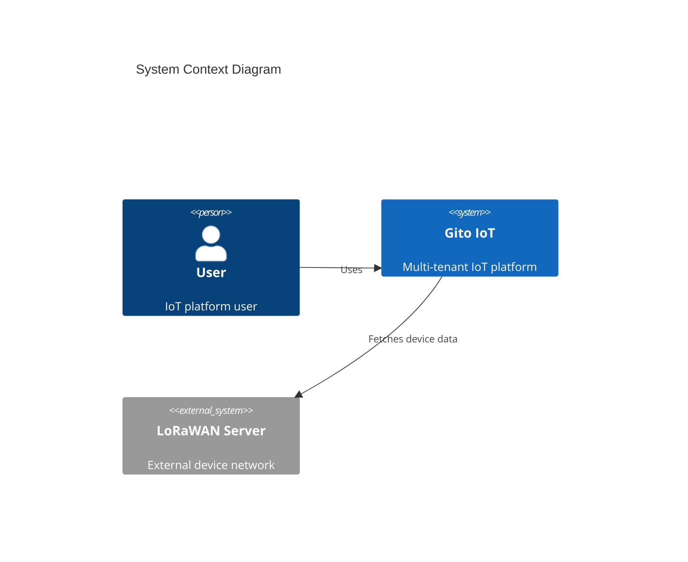
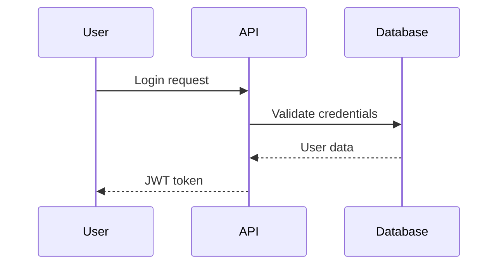
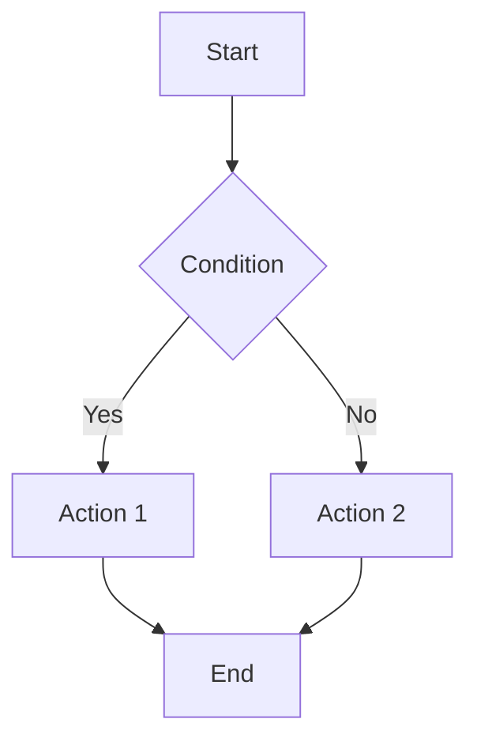

# Gito IoT Platform - Documentation

**Last Updated: 2026-01-31**

## Overview

This directory contains architectural documentation following the **C4 Model** (Context, Containers, Components, Code) with diagrams rendered using **Mermaid**.

---

## 📁 Folder Structure

```
/docs
├── architecture/     # C4 Model documentation
│   ├── 01-context.md         # System Context (Level 1)
│   ├── 02-containers.md      # Container diagram (Level 2)
│   ├── 03-components/        # Component diagrams (Level 3)
│   └── 04-code/              # Code diagrams (Level 4)
│
├── adr/             # Architecture Decision Records
│   ├── template.md           # ADR template
│   ├── 001-multi-tenancy.md
│   ├── 002-rls-security.md
│   └── ...
│
└── diagrams/        # Specific flow/sequence diagrams
    ├── authentication-flow.md
    ├── telemetry-ingestion.md
    └── ...
```

---

## 📐 C4 Model Levels

### Level 1: System Context
**File:** `architecture/01-context.md`

Shows the system boundary and external actors/systems.
- Users, external services, integrations
- High-level view (non-technical stakeholders)

### Level 2: Container Diagram
**File:** `architecture/02-containers.md`

Shows major containers (applications, databases, services).
- Frontend, API, Database, Message Queue, etc.
- Technology choices visible

### Level 3: Component Diagram
**Files:** `architecture/03-components/*.md`

Zooms into a specific container to show internal components.
- One file per major container
- Shows internal architecture

### Level 4: Code Diagram
**Files:** `architecture/04-code/*.md`

Shows class/function level details (use sparingly).
- Only for critical/complex components
- Often better represented in actual code

---

## 📝 Documentation Standards

### All Documents Must Include:
```markdown
# Document Title
**Last Updated: YYYY-MM-DD**

[Content here]

---
## Changelog
- YYYY-MM-DD: Initial version
- YYYY-MM-DD: Updated XYZ
```

### Diagram Syntax
- **C4 Diagrams:** Use `C4Context`, `C4Container`, `C4Component`
- **Flows:** Use `sequenceDiagram`, `flowchart`
- **State:** Use `stateDiagram-v2`
- **ERD:** Use `erDiagram`

### Naming Conventions
- Use kebab-case for filenames: `authentication-flow.md`
- Descriptive titles: "User Authentication Flow" not "Flow 1"
- Date format: `YYYY-MM-DD`

---

## 🎯 When to Create Diagrams

### Create diagrams for:
- ✅ System architecture overview
- ✅ Multi-step workflows
- ✅ Complex integrations
- ✅ Data flows
- ✅ Security boundaries
- ✅ Deployment architecture

### Don't create diagrams for:
- ❌ Simple CRUD operations
- ❌ Single-step processes
- ❌ Self-explanatory code
- ❌ Frequently changing details

---

## 📋 Architecture Decision Records (ADRs)

### When to Create an ADR
Create an ADR for significant architectural decisions:
- Technology choices (database, framework, etc.)
- Security patterns (RLS, JWT, etc.)
- Scalability approaches (caching, sharding, etc.)
- Integration patterns (REST, GraphQL, WebSocket, etc.)

### ADR Template
See `adr/template.md` for the standard format.

### ADR Naming
- Sequential numbering: `001-title.md`, `002-title.md`
- Use kebab-case for title
- Keep titles concise

---

## 🔍 Finding Documentation

### By Topic:
- **Architecture Overview:** `architecture/01-context.md`
- **Database Design:** `diagrams/database-schema.md`
- **API Structure:** `architecture/03-components/api-server.md`
- **Auth Flow:** `diagrams/authentication-flow.md`

### By Date:
Check "Last Updated" field at top of each file.

### By Decision:
Browse `adr/` folder chronologically.

---

## 🛠️ Mermaid Quick Reference

### C4 Context Diagram


### Sequence Diagram


### Flowchart


---

## 🔄 Keeping Docs Updated

### Triggers for Updates:
1. **New Feature:** Add to relevant component diagram
2. **Architecture Change:** Update container/component diagrams + create ADR
3. **Integration Added:** Update context diagram
4. **Flow Changed:** Update sequence diagrams

### Review Schedule:
- **Weekly:** Check if any recent changes need documentation
- **Per PR:** Update docs if architecture affected
- **Per Release:** Verify all diagrams current

---

## 🎓 Resources

### C4 Model
- [C4 Model Website](https://c4model.com/)
- [C4 Model Guide](https://c4model.com/#Abstractions)

### Mermaid
- [Mermaid Documentation](https://mermaid.js.org/)
- [Mermaid Live Editor](https://mermaid.live/)
- [C4 Mermaid Examples](https://mermaid.js.org/syntax/c4.html)

### ADR
- [ADR GitHub](https://adr.github.io/)
- [ADR Best Practices](https://github.com/joelparkerhenderson/architecture-decision-record)

---

## 📊 Current Documentation Status

| Level | Status | Files | Last Updated |
|-------|--------|-------|--------------|
| Context (L1) | ⏳ TODO | 0 | - |
| Containers (L2) | ⏳ TODO | 0 | - |
| Components (L3) | ⏳ TODO | 0 | - |
| ADRs | ⏳ TODO | 0 | - |
| Diagrams | ⏳ TODO | 0 | - |

**Note:** Diagrams will be created on-demand as needed for specific components/flows.

---

**Maintained by:** Development Team
**Documentation Standard:** C4 Model + Mermaid
**Living Documentation:** Updated with code changes
